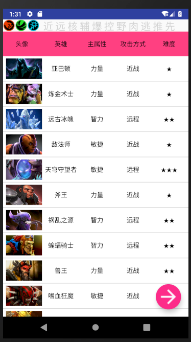
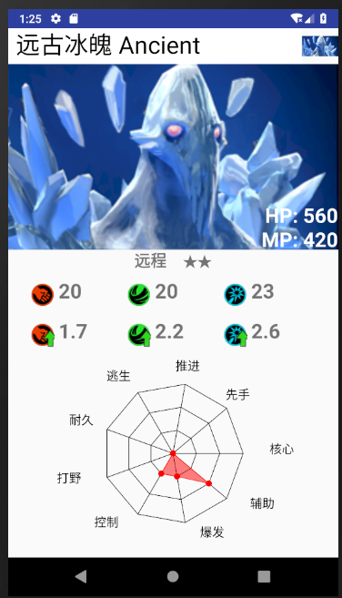
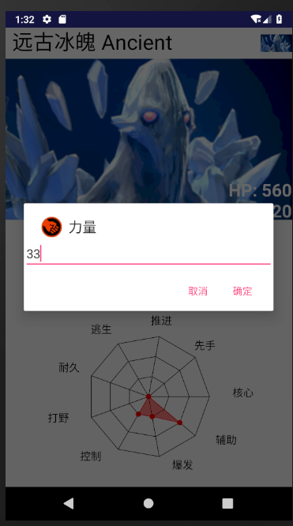

# 中山大学数据科学与计算机学院本科生实验报告
## （2018年秋季学期）
| 课程名称 | 手机平台应用开发 | 任课老师 | 郑贵锋 |
| :------------: | :-------------: | :------------: | :-------------: |
| 年级 | 2016级 | 专业（方向） | 软工（计应） |
| 学号 | 16340297 | 姓名 | 张子轩 |
| 电话 | 15626447297 | Email | 993539017@qq.com |
| 开始日期 | 11.22 | 完成日期 | 11.25

---

## 一、实验题目

期中项目

---

## 二、实现内容

### 本人实现内容：

- 实现英雄详情界面xml和java文件。
- 参与设计应用。
- 图标修改与处理。
- 协助检测代码漏洞及运行代码
- 完成项目文档。

---

## 三、课堂实验结果
### (1)实验截图
- 主界面：

    

- 详情界面:

    

- 修改属性值

    

### (2)实验步骤以及关键代码
- 详情界面布局部分没什么特点，不在这里贴出。

- 详情界面读取信息:

         super.onCreate(savedInstanceState);
        setContentView(R.layout.activity_details);
        Bundle bundle = this.getIntent().getExtras();
        final int id = bundle.getInt("id");
        final Database database = new Database(DetailsActivity.this);
        hero = database.queryHero(id);
        bitmap = hero.getIcon();
        img = findViewById(R.id.detail_image);
        img.setImageBitmap(bitmap);
        hp_num = findViewById(R.id.detail_hp);
        hp_num.setText("HP: " + hero.getHealth());
        mp_num = findViewById(R.id.detail_mp);
        mp_num.setText("MP: " + hero.getMana());
        strength_num = findViewById(R.id.detail_strength);
        strength_num.setText(hero.getStrength() + "");
        agility_num = findViewById(R.id.detail_agility);
        agility_num.setText(hero.getAgility() + "");
        intelligence_num = findViewById(R.id.detail_iq);
        intelligence_num.setText(hero.getIntelligence() + "");
        strength_num_up = findViewById(R.id.detail_up_strength);
        strength_num_up.setText(hero.getStrengthUp() + "");
        agility_num_up = findViewById(R.id.detail_up_agility);
        agility_num_up.setText(hero.getAgilityUp() + "");
        intelligence_num_up = findViewById(R.id.detail_up_iq);
        intelligence_num_up.setText(hero.getIntelligenceUp() + "");
        name = findViewById(R.id.detail_name);
        name.setText(hero.getChineseName() + " " + hero.getName());
        diffcult_rate = findViewById(R.id.detail_difficulty_rate);
        attack_mode = findViewById(R.id.detail_attack_mode);
        attack_mode.setText(hero.getAttackMode().ordinal() == 0 ? "近战" : "远程");
        int num = hero.getDifficult();
        String str = "";
        for (int i = 0; i < num; i++) {
            str += "★";
        }
        diffcult_rate.setText(str);
        mini_img = findViewById(R.id.detail_mini_img);
        mini_bitmap = hero.getMinimapIcon();
        mini_img.setImageBitmap(mini_bitmap);

- 属性值点击事件（以智力成长为例）： 

        intelligence_num_up.setOnClickListener(new View.OnClickListener() {
            @Override
            public void onClick(View v) {
                final EditText inputServer = new EditText(DetailsActivity.this);
                AlertDialog.Builder builder = new AlertDialog.Builder(DetailsActivity.this);
                builder.setTitle("智力成长");
                builder.setIcon(R.mipmap.intelligence_attribute_symbol_up);
                builder.setView(inputServer);
                builder.setNegativeButton("取消", new DialogInterface.OnClickListener() {
                    @Override
                    public void onClick(DialogInterface dialog, int which) {

                    }
                });
                builder.setPositiveButton("确定", new DialogInterface.OnClickListener() {
                    public void onClick(DialogInterface dialog, int which) {
                        try {
                            double number = Double.valueOf(inputServer.getText().toString());
                            database.updateHero(id, "intelligence_up", number);
                            intelligence_num_up.setText(number + "");
                            MainActivity.instance.updateList();
                        }
                        catch (Exception e) {

                        }
                    }
                });
                builder.show();
            }
        });

### (3)实验遇到的困难以及解决思路

- 应用界面设计和素材图标不理想导致需要对图片进行一定的修改和规划。

- 对于项目实现内容的方式，小组成员之间存在意见冲突，协商后解决。

- 部分代码出现错误导致程序崩溃，通过小组讨论与上网查询资料解决。

---

## 四、实验思考及感想

- 这次的实验内容是小组合作完成的，是一次新的体验。在实验的过程中，我们先是对应用的整体布局进行一个规划，然后再逐渐添加需求。通过这次的实验，我对于小组合作完成项目有了一定的了解与体会，在遇到问题时，成员之间的讨论十分有效。虽然有时候会有意见冲突但是影响不大。总的来说，通过这次实验，我对于完成安卓应用有了更深的体会。

---
