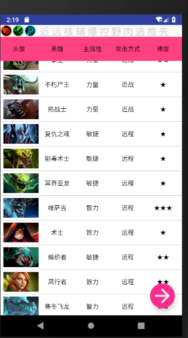
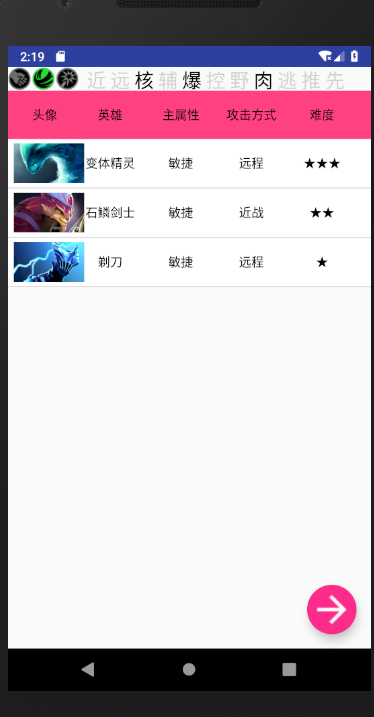
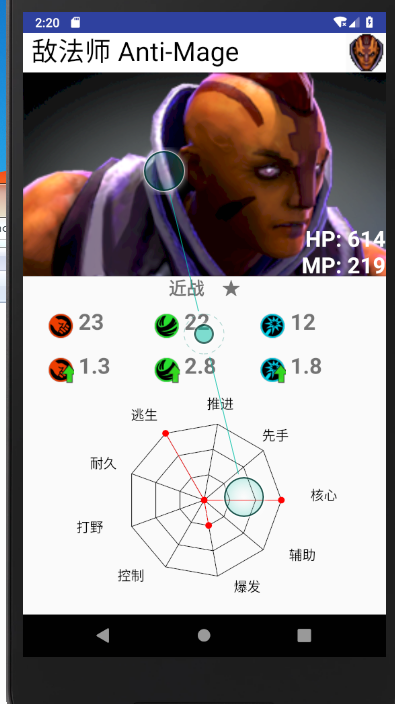
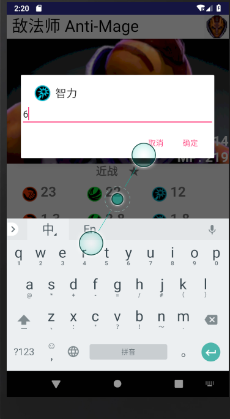
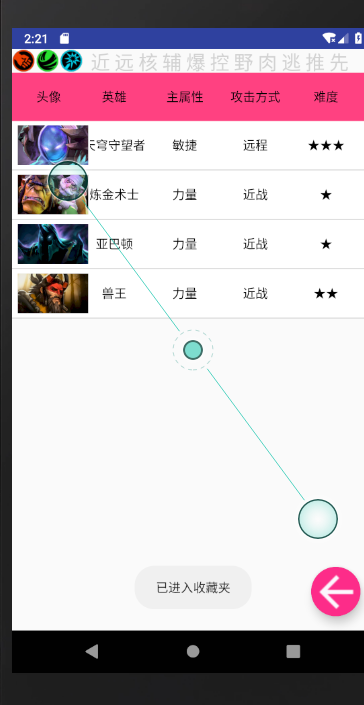

# 中山大学数据科学与计算机学院本科生实验报告
## （2018年秋季学期）
| 课程名称 | 手机平台应用开发 | 任课老师 | 郑贵锋 |
| :------------: | :-------------: | :------------: | :-------------: |
| 年级 | 16级 | 专业（方向） | 软工 |
| 学号 | 16340300 | 姓名 | 赵佳乐 |
| 电话 | 18877109849 | Email | 25041977515@qq.com |
| 开始日期 | 11.22 | 完成日期 | 11.25 |

---

## 一、实验题目

期中项目

---

## 二、实现内容

+ Dota2英雄大全
    - 显示英雄列表，及其属性和图片。共有116个英雄，26个属性。
    - 点击顶部不同属性按钮可以按要求筛选英雄。
    - 点击英雄头像进入详情界面。
    - 详情界面可修改部分英雄属性。
    - 主界面长按可以选择收藏。
    - 点击悬浮图标进入收藏列表。
    - 收藏列表长按可以删除英雄。

+ 本人完成部分

    - 主界面UI。
    - 部分主界面事件处理。
    - app动画级图标。

---

## 三、课堂实验结果
### (1)实验截图

  
### (2)实验步骤以及关键代码

+ 实现主界面的横向和纵向滑动。
    - 纵向滑动通过listView实现，代码很简单，不贴了。

    - 横向滑动通过自定义CustomHScrollView类实现，嵌套在listview里面，继承自HorizontalScrollView类。其中定义了一个滚动观察者，用于监听滚动事件，每次滚动事件的触发（包括标题头和数据行每一行的滚动）都会通知给观察者，之后观察者再通知给它的订阅者，保持滚动的一致性。

            public class CustomHScrollView extends HorizontalScrollView {

                ScrollViewObserver mScrollViewObserver = new ScrollViewObserver();

                public CustomHScrollView(Context context) {
                    super(context);
                }

                public CustomHScrollView(Context context, AttributeSet attrs) {
                    super(context, attrs);
                }

                public CustomHScrollView(Context context, AttributeSet attrs, int defStyleAttr) {
                    super(context, attrs, defStyleAttr);
                }

                @Override
                public boolean onTouchEvent(MotionEvent ev) {
                    return super.onTouchEvent(ev);
                }

                @Override
                protected void onScrollChanged(int l, int t, int oldl, int oldt) {
                    //滚动时通知观察者
                    if (mScrollViewObserver != null) {
                        mScrollViewObserver.NotifyOnScrollChanged(l, t, oldl, oldt);
                    }
                    super.onScrollChanged(l, t, oldl, oldt);
                }

                /*
                * 当发生了滚动事件时接口，供外部访问
                */
                public static interface OnScrollChangedListener {
                    public void onScrollChanged(int l, int t, int oldl, int oldt);
                }

                /*
                * 添加滚动事件监听
                * */
                public void AddOnScrollChangedListener(OnScrollChangedListener listener) {
                    mScrollViewObserver.AddOnScrollChangedListener(listener);
                }

                /*
                * 移除滚动事件监听
                * */
                public void RemoveOnScrollChangedListener(OnScrollChangedListener listener) {
                    mScrollViewObserver.RemoveOnScrollChangedListener(listener);
                }
                /*
                * 滚动观察者
                */
                public static class ScrollViewObserver {
                    List<OnScrollChangedListener> mChangedListeners;

                    public ScrollViewObserver() {
                        super();
                        mChangedListeners = new ArrayList<OnScrollChangedListener>();
                    }
                    //添加滚动事件监听
                    public void AddOnScrollChangedListener(OnScrollChangedListener listener) {
                        mChangedListeners.add(listener);
                    }
                    //移除滚动事件监听
                    public void RemoveOnScrollChangedListener(OnScrollChangedListener listener) {
                        mChangedListeners.remove(listener);
                    }
                    //通知
                    public void NotifyOnScrollChanged(int l, int t, int oldl, int oldt) {
                        if (mChangedListeners == null || mChangedListeners.size() == 0) {
                            return;
                        }
                        for (int i = 0; i < mChangedListeners.size(); i++) {
                            if (mChangedListeners.get(i) != null) {
                                mChangedListeners.get(i).onScrollChanged(l, t, oldl, oldt);
                            }
                        }
                    }
                }
            }
    
    - 同时要实现一个类用于拦截滑动的动作，保证横向和竖向滑动的动作不冲突。

            public class InterceptScrollLinearLayout extends LinearLayout {

                public InterceptScrollLinearLayout(Context context) {
                    super(context);
                }

                public InterceptScrollLinearLayout(Context context, AttributeSet attrs, int defStyleAttr) {
                    super(context, attrs, defStyleAttr);
                }

                public InterceptScrollLinearLayout(Context context, AttributeSet attrs) {
                    super(context, attrs);
                }

                @Override
                public boolean onInterceptTouchEvent(MotionEvent ev) {
                    return true;
                }
            }

    - listViewAdpter的实现比较简单，主要完成getView函数即可。

            public View getView(int i, View view, ViewGroup group) {
                MyViewHolder holder;
                final Hero hero = mList.get(i);
                if (view == null) {
                    view = mInflater.inflate(R.layout.list_item, group, false);
                    holder = new MyViewHolder();
                    CustomHScrollView scrollView = (CustomHScrollView) view.findViewById(R.id.h_scrollView);
                    holder.scrollView = scrollView;
                    holder.imageViewIcon = (ImageView) view.findViewById(R.id.imageViewIcon);
                    ...
                    view.setTag(holder);
                }
                else {
                    holder = (MyViewHolder) view.getTag();
                }
                holder.imageViewIcon.setImageBitmap(hero.getIcon());
                ...
                    @Override
                    public void onClick(View v) {
                        Intent intent = new Intent(MainActivity.instance, DetailsActivity.class);
                        Bundle bundle = new Bundle();
                        bundle.putInt("id", hero.getId());
                        intent.putExtras(bundle);
                        MainActivity.instance.startActivity(intent);
                    }
                });
                return view;
            }

    - 横向滚动的监听器，注意要记录滚动的起始位置，刷新时要让标题头变为初始状态。

               class OnScrollChangedListenerImp implements CustomHScrollView.OnScrollChangedListener {
                    CustomHScrollView mScrollViewArg;

                    public OnScrollChangedListenerImp(CustomHScrollView scrollViewar) {
                        mScrollViewArg = scrollViewar;
                    }

                    @Override
                    public void onScrollChanged(int l, int t, int oldl, int oldt) {
                        mScrollViewArg.smoothScrollTo(l, t);
                        if (n == 1) {
                            new MainActivity().setPosData(oldl, oldt);
                        }
                        n++;
                    }
                };

+ 下拉时隐藏悬浮图标的实现，导入了依赖:

            implementation 'com.melnykov:floatingactionbutton:1.3.0'

    - 使用com.melnykov.fab.FloatingActionButton的attachToListView函数实现。

            fab = (FloatingActionButton) findViewById(R.id.fab);
            fab.attachToListView(mListView);
    
+ app开始动画，新建一个Activity播放动画，动画为一张图片渐变。

    - 在动画开始时把英雄数据导入数据库。

            imageView = (ImageView) findViewById(R.id.loadImage);
            // 设置加载动画透明度渐变从（0.1不显示-1.0完全显示）
            AlphaAnimation animation = new AlphaAnimation(0f, 1.0f);
            // 设置动画时间5s
            animation.setDuration(100);

            // 将组件与动画关联
            imageView.setAnimation(animation);

            animation.setAnimationListener(new AnimationListener() {
                // 动画开始时执行
                public void onAnimationStart(Animation animation) {
                    // TODO Auto-generated method stub
                    // 初始化
                    if (heroList.size() == 0) {
                        initHero();
                    }

                }

                // 动画重复时执行
                public void onAnimationRepeat(Animation animation) {
                    // TODO Auto-generated method stub

                }

                // 动画结束时执行
                public void onAnimationEnd(Animation animation) {
                    Intent intent = new Intent(Splash.this, MainActivity.class);
                    startActivity(intent);
                    finish();
                }
            });
  
### (3)实验遇到的困难以及解决思路

+ 一开始listView在横向滑动后再纵向滑动可能会出现标题和数据不对齐的问题，最后发现是getView函数没有判断view是否为null，view为null的话直接执行：

        holder = (MyViewHolder) view.getTag();

+ 主界面加载动画时不来想用非阻塞方法，同时加载动画和导入数据库，但是发现导入数据库的时间并不确定，并且只需在第一次启动时加载数据进入数据库，所以把动画时间设置太长也不行，因此就在动画开始时导入数据库。

        public void onAnimationStart(Animation animation) {
                // TODO Auto-generated method stub
                // 初始化
                if (heroList.size() == 0) {
                    initHero();
                }

            }

  
---

## 五、实验思考及感想

+ 本次实验充分体会到了小组分工合作完成一个项目的过程。

+ 同时本次实验我们查找了很多资料，导入了一些依赖和别人写好的jar包，充分体会到了查找资料能力的重要性。

+ 总之，本次实验虽然过程很艰难，但是收获还是很大的。

---

#### 作业要求
* 命名要求：学号_姓名_实验编号，例如12345678_张三_lab1.md
* 实验报告提交格式为md
* 实验内容不允许抄袭，我们要进行代码相似度对比。如发现抄袭，按0分处理