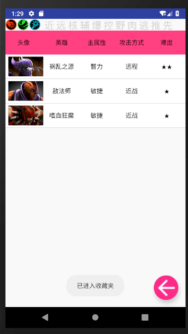

# 中山大学数据科学与计算机学院本科生实验报告
## （2018年秋季学期）
| 课程名称 | 手机平台应用开发 | 任课老师 | 郑贵锋 |
| :------------: | :-------------: | :------------: | :-------------: |
| 年级 | 大三 | 专业（方向） | 软工（数媒） |
| 学号 | 16340312 | 姓名 | 周泽昊 |
| 电话 | 15626185340 | Email | 916142362@qq.com |
| 开始日期 | 10.22 | 完成日期 | 11.25

---

## 一、实验题目 
期中项目

---

## 二、实现内容


* 完成自定义控件——`RadarView`雷达图的设计
* 参与detail界面的与`detailActivity`
* 部分数据库的设计
* 设计整体结构和部分UI
* 帮助队友设计以及debug

---

## 三、课堂实验结果
### (1)实验截图一

- 实验界面（收藏以及筛选部分没有参与做，所以就不截图了）

    

- 收藏夹

    

- 详情界面

    
### (2)实验步骤以及关键代码

1. 自定义控件`RadarView`类来实现

```java
package com.example.administrator.midtermprojectgruop35;

import android.content.Context;
import android.graphics.Canvas;
import android.graphics.Color;
import android.graphics.Paint;
import android.graphics.Path;
import android.support.annotation.Nullable;
import android.util.AttributeSet;
import android.view.View;

import java.util.ArrayList;
import java.util.List;


public class RadarView extends View {

    //数据个数
    private int count = 9;
    //网格最大半径
    private float radius;
    //中心X
    private int centerX;
    //中心Y
    private int centerY;
    //雷达区画笔
    private Paint mainPaint;
    //文本画笔
    private Paint textPaint;
    //数据区画笔
    private Paint valuePaint;
    //标题文字
    private List<String> titles;
    //各维度分值
    private List<Double> data;
    //数据最大值
    private float maxValue = 3;
    private float angle;

    public RadarView(Context context) {
        this(context, null);
    }

    public RadarView(Context context, @Nullable AttributeSet attrs) {
        this(context, attrs, 0);
    }

    public RadarView(Context context, @Nullable AttributeSet attrs, int defStyleAttr) {
        super(context, attrs, defStyleAttr);
        init();
    }

    private void init() {
        mainPaint = new Paint();
        mainPaint.setColor(Color.BLACK);
        mainPaint.setAntiAlias(true);
        mainPaint.setStrokeWidth(2);
        mainPaint.setStyle(Paint.Style.STROKE);

        textPaint = new Paint();
        textPaint.setColor(Color.BLACK);
        textPaint.setTextAlign(Paint.Align.CENTER);
        textPaint.setTextSize(40);
        textPaint.setStrokeWidth(2);
        textPaint.setAntiAlias(true);

        valuePaint=new Paint();
        valuePaint.setColor(Color.RED);
        valuePaint.setStrokeWidth(2);
        valuePaint.setAntiAlias(true);
        valuePaint.setStyle(Paint.Style.FILL);

        titles = new ArrayList<>(count);
        titles.add("核心");
        titles.add("辅助");
        titles.add("爆发");
        titles.add("控制");
        titles.add("打野");
        titles.add("耐久");
        titles.add("逃生");
        titles.add("推进");
        titles.add("先手");

        data=new ArrayList<>(count);
        data.add(0.0);
        data.add(0.0);
        data.add(0.0);
        data.add(0.0);
        data.add(0.0);
        data.add(0.0);
        data.add(0.0);
        data.add(0.0);
        data.add(0.0);
    }

    @Override
    protected void onSizeChanged(int w, int h, int oldw, int oldh) {
        radius = Math.min(w, h) / 2 * 0.7f;
        centerX = w / 2;
        centerY = h / 2;
        //一旦size发生改变，重新绘制
        postInvalidate();
        super.onSizeChanged(w, h, oldw, oldh);
    }

    @Override
    protected void onDraw(Canvas canvas) {
        drawPolygon(canvas);
        drawLines(canvas);
        drawTitle(canvas);
        drawRegion(canvas);
    }

    /**
     * 绘制多边形
     *
     * @param canvas
     */
    private void drawPolygon(Canvas canvas) {
        Path path = new Path();
        //1度=1*PI/180   360度=2*PI   那么我们每旋转一次的角度为2*PI/内角个数
        //中心与相邻两个内角相连的夹角角度
        angle = (float) (2 * Math.PI / count);
        //每个蛛丝之间的间距
        float r = radius / maxValue;
        for (int i = 0; i < maxValue+1; i++) {
            //当前半径
            float curR = r * i;
            path.reset();
            for (int j = 0; j < count; j++) {
                if (j == 0) {
                    path.moveTo(centerX + curR, centerY);
                } else {
                    //对于直角三角形sin(x)是对边比斜边，cos(x)是底边比斜边，tan(x)是对边比底边
                    //因此可以推导出:底边(x坐标)=斜边(半径)*cos(夹角角度)
                    //               对边(y坐标)=斜边(半径)*sin(夹角角度)
                    float x = (float) (centerX + curR * Math.cos(angle * j));
                    float y = (float) (centerY + curR * Math.sin(angle * j));
                    path.lineTo(x, y);
                }
            }
            path.close();
            canvas.drawPath(path, mainPaint);
        }
    }

    /**
     * 绘制直线
     */
    private void drawLines(Canvas canvas) {
        Path path = new Path();
        for (int i = 0; i < count; i++) {
            path.reset();
            path.moveTo(centerX, centerY);
            float x = (float) (centerX + radius * Math.cos(angle * i));
            float y = (float) (centerY + radius * Math.sin(angle * i));
            path.lineTo(x, y);
            canvas.drawPath(path, mainPaint);
        }
    }

    /**
     * 绘制标题文字
     *
     * @param canvas
     */
    private void drawTitle(Canvas canvas) {
        if (count != titles.size()) {
            return;
        }
        //相关知识点:http://mikewang.blog.51cto.com/3826268/871765/
        Paint.FontMetrics fontMetrics = textPaint.getFontMetrics();
        float fontHeight = fontMetrics.descent - fontMetrics.ascent;
        //绘制文字时不让文字和雷达图形交叉,加大绘制半径
        float textRadius = radius + fontHeight;
        double pi = Math.PI;
        for (int i = 0; i < count; i++) {
            float x = (float) (centerX + textRadius * Math.cos(angle * i));
            float y = (float) (centerY + textRadius * Math.sin(angle * i));
            //当前绘制标题所在顶点角度
            float degrees = angle * i;
            //从右下角开始顺时针画起,与真实坐标系相反
            if (degrees >= 0 && degrees < pi / 2) {//第四象限
                float dis=textPaint.measureText(titles.get(i))/(titles.get(i).length()-1);
                canvas.drawText(titles.get(i), x+dis, y, textPaint);
            } else if (degrees >= pi / 2 && degrees < pi) {//第三象限
                float dis=textPaint.measureText(titles.get(i))/(titles.get(i).length()-1);
                canvas.drawText(titles.get(i), x-dis, y, textPaint);
            } else if (degrees >= pi && degrees < 3 * pi / 2) {//第二象限
                float dis=textPaint.measureText(titles.get(i))/(titles.get(i).length());
                canvas.drawText(titles.get(i), x-dis, y, textPaint);
            } else if (degrees >= 3 * pi / 2 && degrees <= 2 * pi) {//第一象限
                canvas.drawText(titles.get(i), x, y, textPaint);
            }
        }

    }

    /**
     * 绘制覆盖区域
     */
    private void drawRegion(Canvas canvas){
        valuePaint.setAlpha(255);
        Path path=new Path();
        for (int i = 0; i < count; i++) {
            //计算该数值与最大值比例
            Double perCenter = data.get(i)/maxValue;
            //小圆点所在位置距离圆心的距离
            double perRadius=perCenter*radius;
            float x = (float) (centerX + perRadius * Math.cos(angle * i));
            float y = (float) (centerY + perRadius * Math.sin(angle * i));
            if(i==0){
                path.moveTo(x,y);
            }else {
                path.lineTo(x,y);
            }
            //绘制小圆点
            canvas.drawCircle(x,y,10,valuePaint);
        }
        //闭合覆盖区域
        path.close();
        valuePaint.setStyle(Paint.Style.STROKE);
        //绘制覆盖区域外的连线
        canvas.drawPath(path, valuePaint);
        //填充覆盖区域
        valuePaint.setAlpha(128);
        valuePaint.setStyle(Paint.Style.FILL);
        canvas.drawPath(path,valuePaint);
    }

    //设置数值种类
    public void setCount(int count) {
        this.count = count;
        postInvalidate();
    }

    //设置蜘蛛网颜色
    public void setMainPaint(Paint mainPaint) {
        this.mainPaint = mainPaint;
        postInvalidate();
    }

    //设置标题颜色
    public void setTextPaint(Paint textPaint) {
        this.textPaint = textPaint;
    }

    //设置标题
    public void setTitles(ArrayList<String> titles) {
        this.titles = titles;
    }

    //设置覆盖局域颜色
    public void setValuePaint(Paint valuePaint) {
        this.valuePaint = valuePaint;
        postInvalidate();
    }

    //设置数值
    public void setData(List<Double> data) {
        this.data = data;
        postInvalidate();
    }

    public List<Double> getData() {
        return data;
    }

    //设置最大数值
    public void setMaxValue(float maxValue) {
        this.maxValue = maxValue;
    }
}
```

2. 使用自定义控件方法

```xml
<com.example.administrator.midtermprojectgruop35.RadarView
    android:id="@+id/rdv"
    android:layout_width="match_parent"
    android:layout_height="250dp"
    />
```

3. 动态更改`RadarView`中的数据

```java
RadarView mRdv = (RadarView) findViewById(R.id.rdv);
List<Double> data;
data=new ArrayList<>(9);
double temp = hero.getCarry();
data.add(temp);
temp = hero.getSupport();
data.add(temp);
temp = hero.getNuker();
data.add(temp);
temp = hero.getDisabler();
data.add(temp);
temp = hero.getJungler();
data.add(temp);
temp = hero.getDurable();
data.add(temp);
temp = hero.getEscape();
data.add(temp);
temp = hero.getPusher();
data.add(temp);
temp = hero.getInitiator();
data.add(temp);
mRdv.setData(data);
```

4. 数据库实现，对英雄信息尽享增删改查

```java
package com.example.administrator.midtermprojectgruop35;

import android.content.ContentValues;
import android.content.Context;
import android.database.Cursor;
import android.database.sqlite.SQLiteDatabase;
import android.database.sqlite.SQLiteOpenHelper;
import android.graphics.Bitmap;
import android.graphics.BitmapFactory;

import java.io.ByteArrayOutputStream;
import java.util.ArrayList;
import java.util.List;

public class Database extends SQLiteOpenHelper {
    public Database(Context context) {
        super(context, "database.db", null, 1);
    }

    @Override
    public void onCreate(SQLiteDatabase sqLiteDatabase) {
        String CREATE_TABLE_HERO = "CREATE TABLE if not exists HERO (id INTEGER PRIMARY KEY, name TEXT, icon BLOB, minimap_icon BLOB, chinese_name TEXT, nickname TEXT, species INTEGER, attack_mode INTEGER, difficult INTEGER, carry INTEGER, support INTEGER, nuker INTEGER, disabler INTEGER, jungler INTEGER, durable INTEGER, escape_ INTEGER, pusher INTEGER, initiator INTEGER, strength INTEGER, agility INTEGER, intelligence INTEGER, strength_up REAL, agility_up REAL, intelligence_up REAL, health INTEGER, mana INTEGER)";
        sqLiteDatabase.execSQL(CREATE_TABLE_HERO);
        String CREATE_TABLE_COLLECT = "CREATE TABLE if not exists COLLECT (id INTERGER PRIMARY KEY REFERENCES HERO(id) ON DELETE CASCADE ON UPDATE CASCADE)";
        sqLiteDatabase.execSQL(CREATE_TABLE_COLLECT);
    }

    @Override
    public void onUpgrade(SQLiteDatabase sqLiteDatabase, int i, int ii) {

    }

    public void insertHero(Hero hero) {
        SQLiteDatabase sqLiteDatabase = getWritableDatabase();
        ContentValues contentValues = new ContentValues();
        ByteArrayOutputStream byteArrayOutputStream = new ByteArrayOutputStream();
        Bitmap bitmapIcon = hero.getIcon();
        bitmapIcon.compress(Bitmap.CompressFormat.PNG, 100, byteArrayOutputStream);
        byte[] icon = byteArrayOutputStream.toByteArray();
        byteArrayOutputStream = new ByteArrayOutputStream();
        Bitmap bitmapMinimapIcon = hero.getMinimapIcon();
        bitmapMinimapIcon.compress(Bitmap.CompressFormat.PNG, 100, byteArrayOutputStream);
        byte[] minimapIcon = byteArrayOutputStream.toByteArray();
        contentValues.put("id", hero.getId());
        contentValues.put("name", hero.getName());
        contentValues.put("icon", icon);
        contentValues.put("minimap_icon", minimapIcon);
        contentValues.put("chinese_name", hero.getChineseName());
        contentValues.put("nickname", hero.getNickname());
        contentValues.put("species", hero.getSpecies().ordinal());
        contentValues.put("attack_mode", hero.getAttackMode().ordinal());
        contentValues.put("difficult", hero.getDifficult());
        contentValues.put("carry", hero.getCarry());
        contentValues.put("support", hero.getSupport());
        contentValues.put("nuker", hero.getNuker());
        contentValues.put("disabler", hero.getDisabler());
        contentValues.put("jungler", hero.getJungler());
        contentValues.put("durable", hero.getDurable());
        contentValues.put("escape_", hero.getEscape());
        contentValues.put("pusher", hero.getPusher());
        contentValues.put("initiator", hero.getInitiator());
        contentValues.put("strength", hero.getStrength());
        contentValues.put("agility", hero.getAgility());
        contentValues.put("intelligence", hero.getIntelligence());
        contentValues.put("strength_up", hero.getStrengthUp());
        contentValues.put("agility_up", hero.getAgilityUp());
        contentValues.put("intelligence_up", hero.getIntelligenceUp());
        contentValues.put("health", hero.getHealth());
        contentValues.put("mana", hero.getMana());
        sqLiteDatabase.insert("HERO", null, contentValues);
        sqLiteDatabase.close();
    }

    public List<Hero> queryHero(String selection) {
        List<Hero> heroList = new ArrayList<Hero>();
        SQLiteDatabase sqLiteDatabase = getReadableDatabase();
        Cursor cursor = sqLiteDatabase.rawQuery("SELECT y.* FROM HERO y WHERE  y." + selection, null);
        while (cursor.moveToNext()) {
            int id = cursor.getInt(0);
            String name = cursor.getString(1);
            byte[] bytesIcon = cursor.getBlob(2);
            Bitmap icon = BitmapFactory.decodeByteArray(bytesIcon, 0, bytesIcon.length);
            byte[] bytesMinimapIcon = cursor.getBlob(3);
            Bitmap minimapIcon = BitmapFactory.decodeByteArray(bytesMinimapIcon, 0, bytesMinimapIcon.length);
            String chineseName = cursor.getString(4);
            String nickname = cursor.getString(5);
            Hero.Species species = Hero.Species.values()[cursor.getInt(6)];
            Hero.AttackMode attackMode = Hero.AttackMode.values()[cursor.getInt(7)];
            int difficult = cursor.getInt(8);
            int carry = cursor.getInt(9);
            int support = cursor.getInt(10);
            int nuker = cursor.getInt(11);
            int disabler = cursor.getInt(12);
            int jungler = cursor.getInt(13);
            int durable = cursor.getInt(14);
            int escape = cursor.getInt(15);
            int pusher = cursor.getInt(16);
            int initiator = cursor.getInt(17);
            int strength = cursor.getInt(18);
            int agility = cursor.getInt(19);
            int intelligence = cursor.getInt(20);
            double strengthUp = cursor.getDouble(21);
            double agilityUp = cursor.getDouble(22);
            double intelligenceUp = cursor.getDouble(23);
            int health = cursor.getInt(24);
            int mana = cursor.getInt(25);
            heroList.add(new Hero(id, name, icon, minimapIcon, chineseName, nickname, species, attackMode, difficult, carry, support, nuker, disabler, jungler, durable, escape, pusher, initiator, strength, agility, intelligence, strengthUp, agilityUp, intelligenceUp, health, mana));
        }
        cursor.close();
        sqLiteDatabase.close();
        return heroList;
    }

    public Hero queryHero(int id) {
        Hero hero = null;
        SQLiteDatabase sqLiteDatabase = getReadableDatabase();
        Cursor cursor = sqLiteDatabase.query("HERO", null, "id = ?", new String[] {id + ""}, null, null, null);
        while (cursor.moveToNext()) {
            String name = cursor.getString(1);
            byte[] bytesIcon = cursor.getBlob(2);
            Bitmap icon = BitmapFactory.decodeByteArray(bytesIcon, 0, bytesIcon.length);
            byte[] bytesMinimapIcon = cursor.getBlob(3);
            Bitmap minimapIcon = BitmapFactory.decodeByteArray(bytesMinimapIcon, 0, bytesMinimapIcon.length);
            String chineseName = cursor.getString(4);
            String nickname = cursor.getString(5);
            Hero.Species species = Hero.Species.values()[cursor.getInt(6)];
            Hero.AttackMode attackMode = Hero.AttackMode.values()[cursor.getInt(7)];
            int difficult = cursor.getInt(8);
            int carry = cursor.getInt(9);
            int support = cursor.getInt(10);
            int nuker = cursor.getInt(11);
            int disabler = cursor.getInt(12);
            int jungler = cursor.getInt(13);
            int durable = cursor.getInt(14);
            int escape = cursor.getInt(15);
            int pusher = cursor.getInt(16);
            int initiator = cursor.getInt(17);
            int strength = cursor.getInt(18);
            int agility = cursor.getInt(19);
            int intelligence = cursor.getInt(20);
            double strengthUp = cursor.getDouble(21);
            double agilityUp = cursor.getDouble(22);
            double intelligenceUp = cursor.getDouble(23);
            int health = cursor.getInt(24);
            int mana = cursor.getInt(25);
            hero = new Hero(id, name, icon, minimapIcon, chineseName, nickname, species, attackMode, difficult, carry, support, nuker, disabler, jungler, durable, escape, pusher, initiator, strength, agility, intelligence, strengthUp, agilityUp, intelligenceUp, health, mana);
        }
        cursor.close();
        sqLiteDatabase.close();
        return hero;
    }

    public void deleteHero(int id) {
        SQLiteDatabase sqLiteDatabase = getWritableDatabase();
        sqLiteDatabase.delete("HERO", "id = ?", new String[] {id + ""});
        sqLiteDatabase.close();
    }

    public List<Hero> listHero() {
        List<Hero> heroList = new ArrayList<Hero>();
        SQLiteDatabase sqLiteDatabase = getReadableDatabase();
        Cursor cursor = sqLiteDatabase.query("HERO", null, null, null, null, null, null);
        while (cursor.moveToNext()) {
            int id = cursor.getInt(0);
            String name = cursor.getString(1);
            byte[] bytesIcon = cursor.getBlob(2);
            Bitmap icon = BitmapFactory.decodeByteArray(bytesIcon, 0, bytesIcon.length);
            byte[] bytesMinimapIcon = cursor.getBlob(3);
            Bitmap minimapIcon = BitmapFactory.decodeByteArray(bytesMinimapIcon, 0, bytesMinimapIcon.length);
            String chineseName = cursor.getString(4);
            String nickname = cursor.getString(5);
            Hero.Species species = Hero.Species.values()[cursor.getInt(6)];
            Hero.AttackMode attackMode = Hero.AttackMode.values()[cursor.getInt(7)];
            int difficult = cursor.getInt(8);
            int carry = cursor.getInt(9);
            int support = cursor.getInt(10);
            int nuker = cursor.getInt(11);
            int disabler = cursor.getInt(12);
            int jungler = cursor.getInt(13);
            int durable = cursor.getInt(14);
            int escape = cursor.getInt(15);
            int pusher = cursor.getInt(16);
            int initiator = cursor.getInt(17);
            int strength = cursor.getInt(18);
            int agility = cursor.getInt(19);
            int intelligence = cursor.getInt(20);
            double strengthUp = cursor.getDouble(21);
            double agilityUp = cursor.getDouble(22);
            double intelligenceUp = cursor.getDouble(23);
            int health = cursor.getInt(24);
            int mana = cursor.getInt(25);
            heroList.add(new Hero(id, name, icon, minimapIcon, chineseName, nickname, species, attackMode, difficult, carry, support, nuker, disabler, jungler, durable, escape, pusher, initiator, strength, agility, intelligence, strengthUp, agilityUp, intelligenceUp, health, mana));
        }
        cursor.close();
        sqLiteDatabase.close();
        return heroList;
    }

    public void insertCollect(int id) {
        SQLiteDatabase sqLiteDatabase = getWritableDatabase();
        ContentValues contentValues = new ContentValues();
        contentValues.put("id", id);
        sqLiteDatabase.insert("COLLECT", null, contentValues);
        sqLiteDatabase.close();
    }

    public List<Hero> listCollect() {
        List<Hero> heroList = new ArrayList<Hero>();
        SQLiteDatabase sqLiteDatabase = getReadableDatabase();
        Cursor cursor = sqLiteDatabase.query("COLLECT", null, null, null, null, null, null);
        while (cursor.moveToNext()) {
            int id = cursor.getInt(0);
            heroList.add(queryHero(id));
        }
        cursor.close();
        sqLiteDatabase.close();
        return heroList;
    }

    public void deleteCollect(int id) {
        SQLiteDatabase sqLiteDatabase = getWritableDatabase();
        sqLiteDatabase.delete("COLLECT", "id = ?", new String[] {id + ""});
        sqLiteDatabase.close();
    }

    public boolean isCollected(int id) {
        List<Hero> heroList = new ArrayList<Hero>();
        SQLiteDatabase sqLiteDatabase = getReadableDatabase();
        Cursor cursor = sqLiteDatabase.query("COLLECT", null, "id = ?", new String[] {id + ""}, null, null, null);
        boolean findFlag = false;
        while (cursor.moveToNext()) {
            findFlag = true;
        }
        cursor.close();
        sqLiteDatabase.close();
        return findFlag;
    }

    public List<Hero> queryCollect(String selection) {
        List<Hero> heroList = new ArrayList<Hero>();
        SQLiteDatabase sqLiteDatabase = getReadableDatabase();
        Cursor cursor = sqLiteDatabase.rawQuery("SELECT y.* FROM COLLECT x, HERO y WHERE x.id = y.id AND y." + selection, null);
        while (cursor.moveToNext()) {
            int id = cursor.getInt(0);
            String name = cursor.getString(1);
            byte[] bytesIcon = cursor.getBlob(2);
            Bitmap icon = BitmapFactory.decodeByteArray(bytesIcon, 0, bytesIcon.length);
            byte[] bytesMinimapIcon = cursor.getBlob(3);
            Bitmap minimapIcon = BitmapFactory.decodeByteArray(bytesMinimapIcon, 0, bytesMinimapIcon.length);
            String chineseName = cursor.getString(4);
            String nickname = cursor.getString(5);
            Hero.Species species = Hero.Species.values()[cursor.getInt(6)];
            Hero.AttackMode attackMode = Hero.AttackMode.values()[cursor.getInt(7)];
            int difficult = cursor.getInt(8);
            int carry = cursor.getInt(9);
            int support = cursor.getInt(10);
            int nuker = cursor.getInt(11);
            int disabler = cursor.getInt(12);
            int jungler = cursor.getInt(13);
            int durable = cursor.getInt(14);
            int escape = cursor.getInt(15);
            int pusher = cursor.getInt(16);
            int initiator = cursor.getInt(17);
            int strength = cursor.getInt(18);
            int agility = cursor.getInt(19);
            int intelligence = cursor.getInt(20);
            double strengthUp = cursor.getDouble(21);
            double agilityUp = cursor.getDouble(22);
            double intelligenceUp = cursor.getDouble(23);
            int health = cursor.getInt(24);
            int mana = cursor.getInt(25);
            heroList.add(new Hero(id, name, icon, minimapIcon, chineseName, nickname, species, attackMode, difficult, carry, support, nuker, disabler, jungler, durable, escape, pusher, initiator, strength, agility, intelligence, strengthUp, agilityUp, intelligenceUp, health, mana));
        }
        cursor.close();
        sqLiteDatabase.close();
        return heroList;
    }

    public void updateHero(int id, String selection, int number) {
        SQLiteDatabase sqLiteDatabase = getReadableDatabase();
        ContentValues values = new ContentValues();
        values.put(selection, number);
        sqLiteDatabase.update("HERO", values, "id = ?", new String[]{id + ""});
        sqLiteDatabase.close();
    }

    public void updateHero(int id, String selection, double number) {
        SQLiteDatabase sqLiteDatabase = getReadableDatabase();
        ContentValues values = new ContentValues();
        values.put(selection, number);
        sqLiteDatabase.update("HERO", values, "id = ?", new String[]{id + ""});
        sqLiteDatabase.close();
    }

}
```

### (3)实验遇到的困难以及解决思路

- 在做英雄数据时候想到使用雷达图，本来以为只是在一个多边形图片上加一点特效，但是后来不知道如何下手，最后在网上学会了自定义控件，自己做了一个雷达图的控件，最后实现下来还是很困难，浪费了好多时间，导致可能看起来做的偏少，但是蛮有趣的

- 一开始界面又`appbar`导致部分雷达图显示不出来，打算使用`scrollview`，可能是因为我想把它加在一个控件下面的原因，怎么都加不上去，百度了一下`scollview`无法使用主要是两点：

  * 只能由一个子控件

  * 其中的`textview`必须全部定义高度
  但是仍然不能解决问题，后来发现只有把高度设置成为`match parent`才行，但是这样的话没法把它放在另一个控件下面，又尝试了`relativelayout`仍然不行，老老实实去掉了`appbar`一个屏幕大小显示完整


## 四、实验思考及感想

实验中的思考与感悟：

本次实验虽然看起来完成的部分不是很多，但是再队友实现的过程中，一直再看着队友打（主要是虽然再旁边看着但是也不好意思就说这一部分是自己做的），相互讨论以及帮忙debug，所以看起来好像本人没有做什么，但是实际上是由参与整个实验内容。另外，前端的设计也是很花费时间，纠结控件摆放位置，甚至还和队友吵起来.....

本次期中项目主要就是运用前几次实验的知识，除了自定义控件这一部分几乎没有用到新的知识点，通过这次实验对前面几次实验，尤其是`listview`等进行了良好的复习，虽然做起来很累，但是能够自己做一款自己的app还是很开心的，大多数问题还都是老毛病，在低级错误上浪费很多时间，尤其是`scrollview`上真的是....醉了，希望以后可以在基础这一部分上再努力努力，提高写代码效率和速度