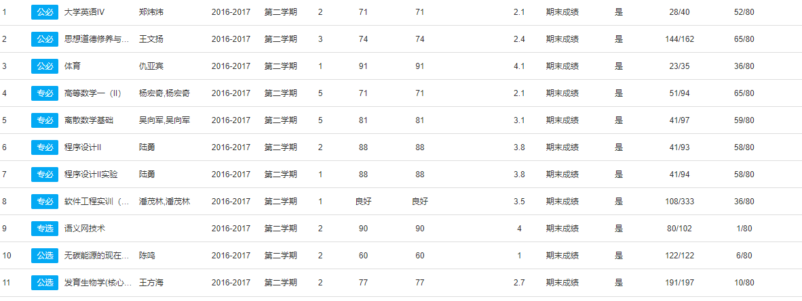

# 已完成的课程作业:

## 安卓平台开发:DOtA2英雄图鉴APP

+ 初次启动应用可能会需要较长时间启动，启动动画结束后进入主界面。
    + 主界面包括英雄信息和查询。
    + 每个英雄单独一列信息，可左右滑动。
    + 共有116个英雄.
    + 主界面中每个英雄展示15个属性, 分别为英雄头像, 中文名字, 主属性(力量, 敏捷或智力), 攻击方式(近战或远程), 难度, 核心指数, 辅助指数, 爆发指数, 控制指数, 打野指数, 耐久指数, 逃生指数, 推进指数, 先手指数.
    + 每个英雄共有23个属性, 分别为英雄头像, 英雄小头像, 英文名字, 中文名字, 主属性(力量, 敏捷或智力), 攻击方式(近战或远程), 难度, 核心指数, 辅助指数, 爆发指数, 控制指数, 打野指数, 耐久指数, 逃生指数, 推进指数, 先手指数, 初始力量值, 初始敏捷值, 初始智力值, 力量成长, 敏捷成长, 智力成长, 初始生命值, 初始魔法值.
    + 在全英雄列表长按英雄信息(一条`item`)可以选择是否将英雄添加至收藏夹, 在收藏夹列表长按英雄信息可以选择是否将英雄移出收藏夹.
    + 点击应用右下角箭头可切换收藏夹与主界面。
    + 主界面如图.

    

    

    

    + 点击左方英雄头像(注意不是点击一条item)可以进入英雄详情界面：
        - 界面包括基础属性值，英雄图标(大、小), 属性雷达图。
        - 点击"力量", "敏捷", "智力", "力量成长", "敏捷成长", "智力成长"的数值可以进行数据修改，对对应数值进行更改并影响英雄生命值或魔法值, 即共可以修改8个属性.
        - 举例. 如图为帕吉的详情界面.

    

## 数字图像处理应用-人脸识别

+ 主要基于PCA主成分分析方法进行特征提取。
+ 每个人脸分为7张图片用于训练集，三张测试集。
+ 取不同的K值，即特征值最大的K个特征进行测试，对比。

##  web 服务与客户端开发实战

+ 页面(3个)
登陆、注册、查询页
+ 资源类型(6个)
films、people、planets、species、starships、vehicles
+ 数据来源
资源数据均抓取与源网站 https://swapi.co/
+ 客户端架构vue
+ 授权访问采用jwt验证
+ 服务api

        获取资源目录(受限资源)
        /api/ GET
        films资源
        /api/films/?page={id} GET
        /api/films/pages GET
        /api/films/{id} GET
        people资源
        /api/people/?page={id} GET
        /api/people/pages GET
        /api/people/{id} GET
        ...

+ 主要界面:

## 另外还有几个学习unity3d课程时制作的小游戏。

+ [牧师与魔鬼](https://github.com/ZhaoJle/3dgame/tree/master/Homework3)
+ [打飞碟](https://github.com/ZhaoJle/3dgame/tree/master/Homework4)
+ [巡逻兵小游戏](https://github.com/ZhaoJle/3dgame/tree/master/Homework6)

## 学习过程中制作的安卓APP

+ [备忘录](https://gitee.com/ZhaoJle/PersonalProject3/blob/master/report/Thursday/16340300ZhaoJle2.md)
+ [音乐播放器](https://gitee.com/ZhaoJle/PersonalProject4/blob/master/report/Thursday/16340300ZhaoJiale/16340300ZhaoJiale.md)
+ [抓取b站数据](https://gitee.com/ZhaoJle/PersonalProject5/blob/master/report/Thursday/16340300ZhaoJle/16340300ZhaoJiale.md)

## 本学期要完成的项目
+ "挣闲钱"应用，目前想法是打算和学校周围一些零售商或者食堂对接，帮学生买东西。
+ 计算机图形学期末作业，制作一个动画短片。

## 以学课程

